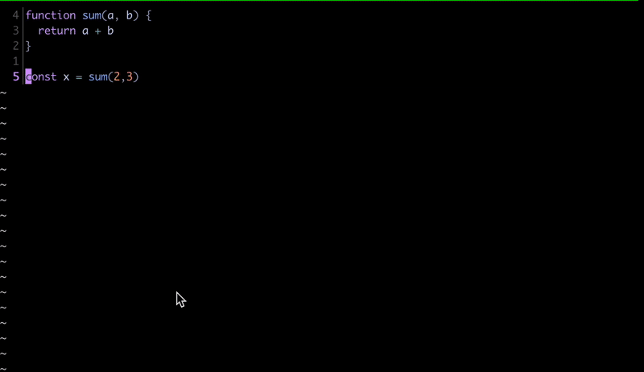

# kak-log

Logging utility for [kakoune](https://kakoune.org/).



## Setup

Using [plug.kak](https://github.com/andreyorst/plug.kak):

```sh
plug 'cameron-yee/kak-log' config %{
    declare-user-mode log

    map global log l ':kak-log<ret>' -docstring 'add log statement for the current selection'
    map global log e ':kak-execute-file<ret>' -docstring 'add log statement for the current selection'
    map global user l ':enter-user-mode<space>log<ret>' -docstring 'log'
}

hook global WinSetOption filetype=(javascript|typescript) %{
    set-option global kak_log_log_fn 'console.log'
    set-option global kak_log_execute_command 'node'
}
```

## Usage

### kak-log

The `kak-log` command will add a print statement to a newline with the current selection.

### kak-execute-file

The `kak-execute-file` command will execute the current file with the `kak_log_execute_command` option and write stdout to a new scratch buffer.
